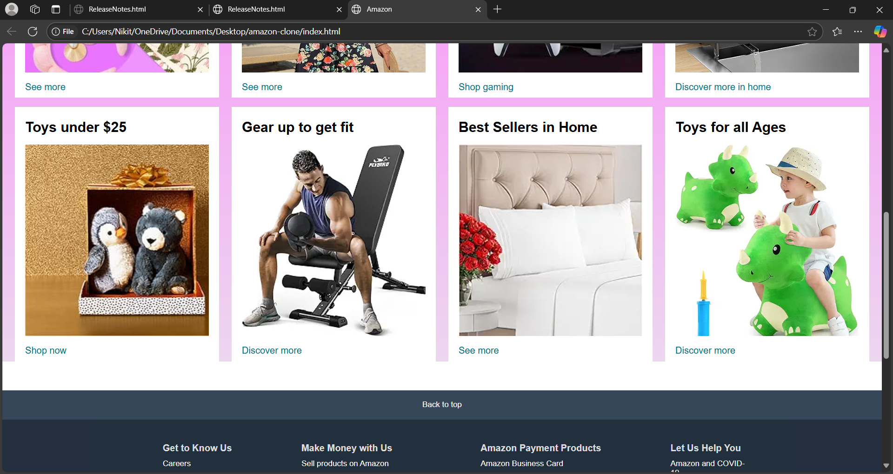
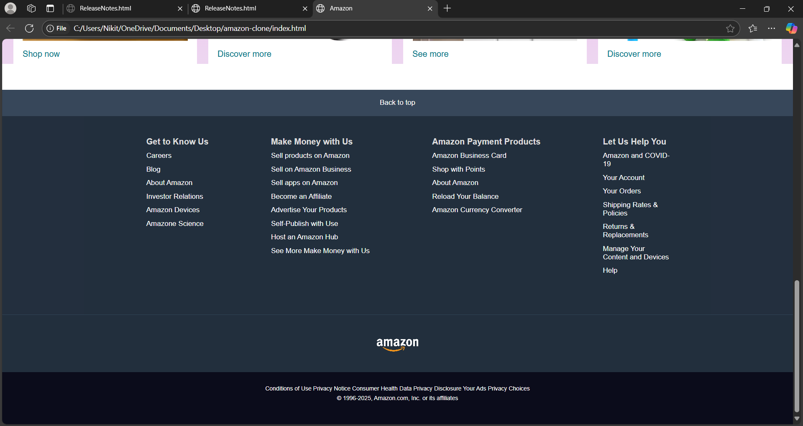

# Amazon Clone 🛍️

A front-end clone of the Amazon homepage, built using **HTML**, **CSS**, and **JavaScript**.

## 🚀 Features
- Responsive layout
- Product section
- Navigation bar
- Footer with links

## 📂 Tech Stack
- HTML5
- CSS3
- JavaScript (Vanilla)

## 📸 Screenshot

.png)




## 🧠 How to Run
1. Clone the repository:
   ```bash
   git clone https://github.com/NikitaKhupse/amazon-clone.git
